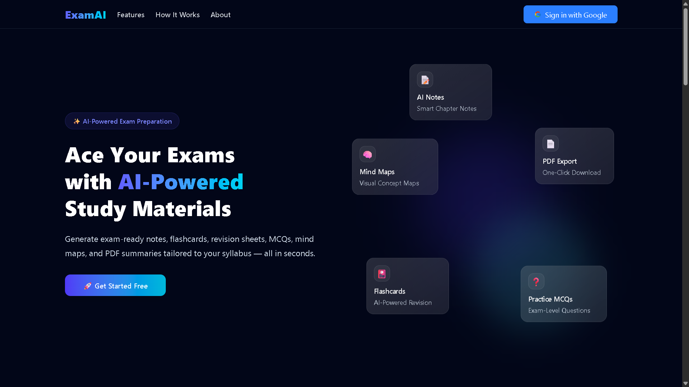
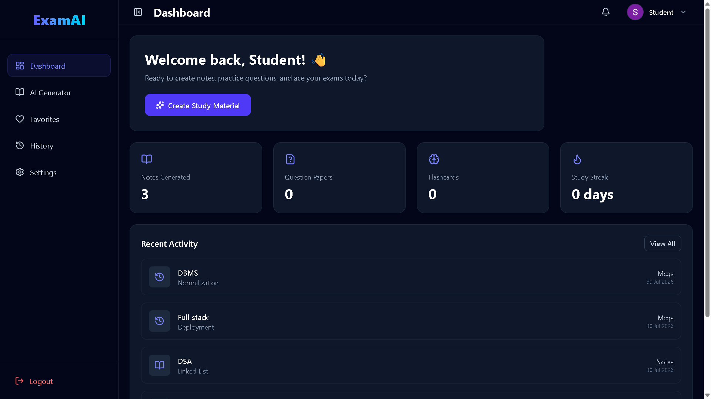
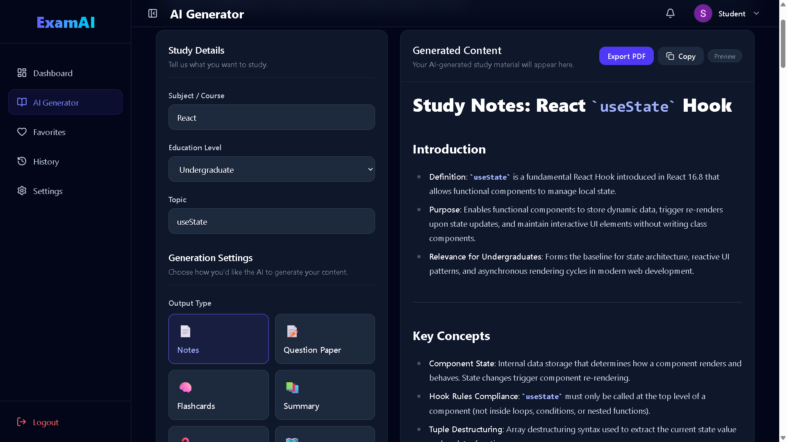
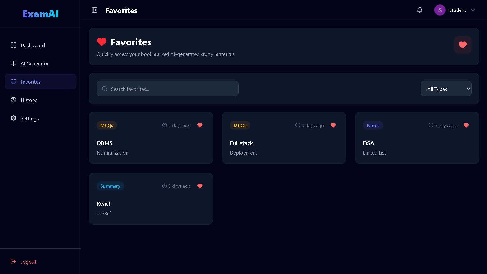
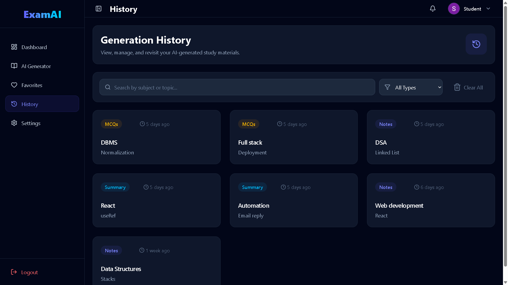
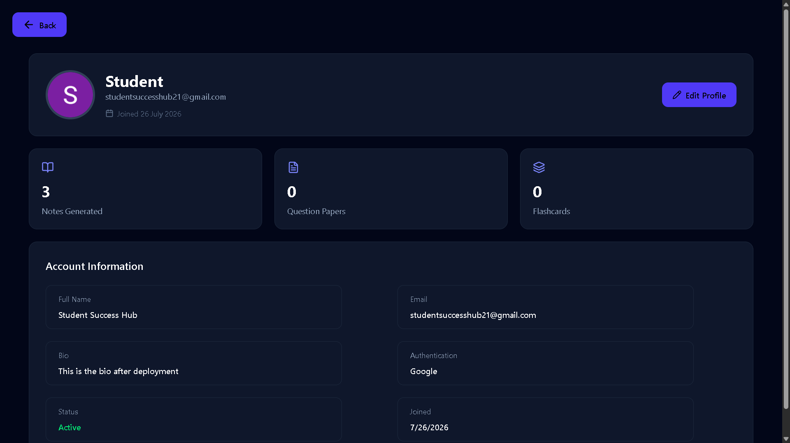
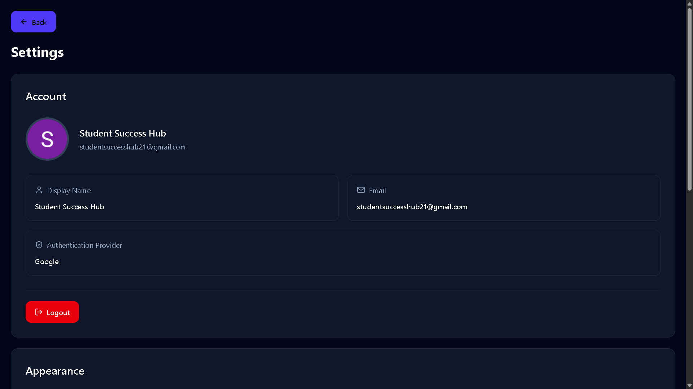

<h1 align="center">
🚀 ExamAI
</h1>

<p align="center">
AI-Powered Study Assistant
</p>

<p align="center">
Generate Notes • Flashcards • Question Papers using AI
</p>

<p align="center">
<a href="https://examai-frontend-xi.vercel.app">🌐 Live Demo</a> •
<a href="https://github.com/Abhinay-Pujala/ExamAI">💻 GitHub</a>
</p>

---

<p align="center">


</p>

## 🌐 Live Demo

**Frontend:** https://examai-frontend-xi.vercel.app

**Backend API:** https://examai-backend-hx8o.onrender.com/

---

## ✨ Features

| Feature                  | Description                             |
| ------------------------ | --------------------------------------- |
| 📝 AI Notes              | Generate structured notes with AI       |
| 🧠 Flashcards            | Create revision flashcards instantly    |
| 📄 Question Papers       | Generate practice exams                 |
| ⭐ Favorites             | Save important generations              |
| 📜 History               | Search and revisit previous generations |
| 📊 Dashboard             | View stats and recent activity          |
| 📥 PDF Export            | Export generated content as PDF         |
| 🔐 Google Authentication | Secure sign-in with Firebase            |

---

# 🛠 Tech Stack

## Frontend

- React
- Vite
- Tailwind CSS
- React Router
- Axios
- Lucide React

## Backend

- Node.js
- Express.js
- MongoDB
- Mongoose
- Firebase Admin SDK
- JWT Authentication

## Deployment

- Vercel (Frontend)
- Render (Backend)

---

# 📂 Project Structure

```text
ExamAI/
│
├── Frontend/
│   ├── src/
│   ├── public/
│   └── ...
│
├── Backend/
│   ├── src/
│   ├── controllers/
│   ├── routes/
│   ├── models/
│   ├── middleware/
│   └── ...
│
└── README.md
```

---

# 🚀 Getting Started

## 1. Clone the repository

```bash
git clone https://github.com/Abhinay-Pujala/ExamAI.git
cd ExamAI
```

## 2. Install dependencies

### Frontend

```bash
cd Frontend
npm install
```

### Backend

```bash
cd Backend
npm install
```

---

# ⚙️ Environment Variables

Create a `.env` file inside the backend directory.

```env
PORT=

MONGODB_URI=

GEMINI_API_KEY=
FIREBASE_PROJECT_ID=
FIREBASE_CLIENT_EMAIL=
FIREBASE_PRIVATE_KEY=
```

Create a `.env` file inside the frontend directory.

```env
VITE_BACKEND_BASE_URL=
VITE_FIREBASE_API_KEY=
```

---

# ▶️ Running Locally

Backend

```bash
npm run dev
```

Frontend

```bash
npm run dev
```

Open:

```
http://localhost:5173
```

---

## 📸 Screenshots

### 🏠 Landing Page



---

### 📊 Dashboard



---

### 📝 AI Generator



---

### ⭐ Favorites



---

### 📜 History



---

### 🧠 Profile



---

### 📄 Settings



---

# 🗺 Roadmap

## ✅ Version 1

- [x] Google Authentication
- [x] AI Notes
- [x] Flashcards
- [x] Question Paper Generator
- [x] Favorites
- [x] History
- [x] Dashboard
- [x] PDF Export
- [x] Search & Filter

## 🚧 Version 2

- [ ] Collections
- [ ] Streaming Responses
- [ ] AI Chat
- [ ] Multiple AI Providers
- [ ] Advanced Analytics
- [ ] Themes
- [ ] Collaboration

---

# 🤝 Contributing

Contributions, issues, and feature requests are welcome.

1. Fork the repository
2. Create a feature branch
3. Commit your changes
4. Push your branch
5. Open a Pull Request

---

# 📄 License

This project is licensed under the MIT License.

---

# 👨‍💻 Author

**Abhinay Pujala**

If you found this project helpful, consider giving it a ⭐ on GitHub!
